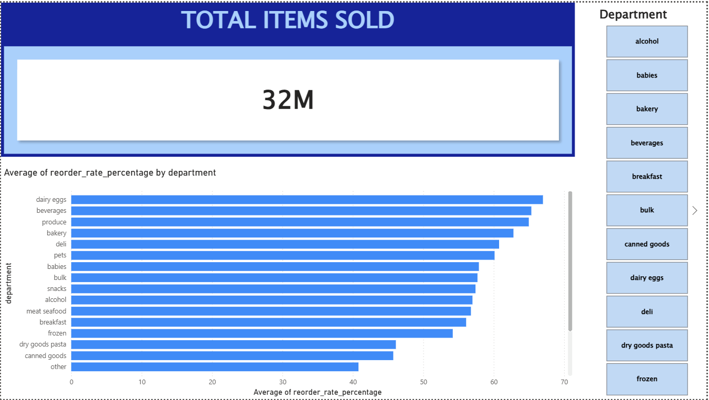

##  Instacart Market Basket Analysis.

## 📖 Project Overview
This project transforms a massive, raw relational database of grocery orders into actionable business insights. Using advanced PostgreSQL techniques, Python-based Data Analytics, and Power BI, this repository demonstrates an end-to-end data pipeline designed to answer critical business questions regarding customer loyalty, product volume, and purchasing affinity. 

**Dataset Used:** [Instacart Market Basket Analysis on Kaggle](https://www.kaggle.com/datasets/psparks/instacart-market-basket-analysis)

---

## 🛠️ Technology Stack
*   **Database & Storage:** PostgreSQL (pgAdmin 4)
*   **Data Transformation (ETL):** SQL (CTEs, Window Functions, Self-Joins)
*   **Data Analytics Engine:** Python, Pandas
*   **Web Application:** Streamlit
*   **Data Visualization:** Power BI
*   **Version Control:** Git & GitHub

---

## 📈 Entire Project Flow
This project was built using a comprehensive data pipeline from raw ingestion to interactive web deployment:

1.  **Data Extraction & Database Provisioning:** Downloaded raw CSV files (50,000+ products, 3M+ orders) and designed a relational database schema within PostgreSQL to mirror Instacart's architecture.
2.  **Data Ingestion & SQL Transformation:** 
    *   Bulk-imported data into PostgreSQL.
    *   Authored advanced SQL queries utilizing Common Table Expressions (CTEs), window functions, and self-joins to clean and aggregate the data.
    *   Created SQL Views to store the results of complex queries for seamless integration.
3.  **Co-Purchase Analytics (Python):** Processed massive transaction logs using Pandas to calculate pure historical basket-share percentages (Market Basket Analysis) without relying on black-box ML models.
4.  **Interactive Web App:** Deployed a custom Streamlit web dashboard allowing users to query the 50,000-item catalog and instantly see data-driven cross-selling recommendations.
5.  **Executive Dashboarding:** Connected Power BI directly to the PostgreSQL database to design an interactive dashboard that communicates volume and loyalty metrics visually.


## 📊 Executive Dashboard
*(The interactive Power BI dashboard provides a top-level view of department performance and customer reorder rates.)*




## 💡 Key Business Questions Answered
This repository contains the logic and scripts designed to answer real-world retail operations questions:
1.  **Volume:** What are the top 10 most popular products across the platform?
2.  **Loyalty:** Which departments have the highest repeat purchase (reorder) rates?
3.  **Market Basket Analysis:** Which products are most frequently bought together in the exact same cart? (Recommendation Engine Logic)

---

## 📁 Repository Structure
```text
📦 instacart-sql-analytics
 ┣ 📂 app
 ┃ ┣ 📜 app.py                 # Streamlit web application frontend
 ┃ ┗ 📜 build_da_tables.py     # Python script to generate co-purchase metrics
 ┣ 📂 data                     # Raw CSV datasets and generated DA tables
 ┣ 📂 powerbi                  # .pbix Power BI dashboard files
 ┣ 📂 screenshots              # Visual documentation and dashboard snapshots
 ┣ 📂 sql                      # PostgreSQL scripts (Schema, EDA, Advanced Queries)
 ┃ ┣ 📜 01_schema_setup.sql
 ┃ ┣ 📜 02_data_exploration.sql
 ┃ ┗ 📜 03_advanced_analysis.sql
 ┣ 📜 requirements.txt         # Python dependencies
 ┗ 📜 README.md

```

---

## 🚀 How to Explore This Repository

### 1. Review the SQL Analysis

You do not need to install anything to view the logic. Navigate to the `/sql` folder and read through the `.sql` files. They are heavily commented to explain the business logic behind the CTEs, window functions, and aggregations used.

### 2. View the Visualizations

Check the `/screenshots` folder for static images of the Power BI dashboard, showing the final insights derived from the SQL data.

### 3. Reproduce the Project Locally

If you wish to run the database, analytics engine, and web app yourself:

1. **Clone the repo:**
```bash
git clone [https://github.com/yourusername/instacart-sql-analytics.git](https://github.com/yourusername/instacart-sql-analytics.git)
cd instacart-sql-analytics

```


2. **Download the Data:** Place the raw CSV files from Kaggle into the `/data` directory.
3. **Set up PostgreSQL:** Run the scripts in the `/sql` folder within pgAdmin to create the tables and import the CSVs.
4. **Set up the Python Environment:**
```bash
python -m venv venv
source venv/bin/activate  # On Windows use: venv\Scripts\activate
pip install -r requirements.txt

```


5. **Generate the Analytics Table:**
```bash
python app/build_da_tables.py

```


6. **Launch the Web App:**
```bash
streamlit run app/app.py

```


7. **Open Power BI:** Open the `.pbix` file in the `/powerbi` folder and update the data source settings to point to your local PostgreSQL instance.

```
